## Base Screenshots

16 source images (4 devices × 4 screens): `desktop-*`, `tablet-*`, `phone-*`, `tv-*` × `home`, `library`, `media-card`, `season`.

After updating these, run: `python scripts/generate_screenshot_assets.py` to regenerate all derived assets.

## Generated Assets

### webp/

WebP versions of all 16 base screenshots (same filenames). For web use.

### extras/

- **playstore-feature-graphic.png** — 1024×500, tablet-home resize to 1024×640 then center crop
- **tv-banner-1280x720.png** — 1280×720, letterbox from tv-home

### App Store (iPhone & iPad)

Resized from phone/tablet assets for App Store Connect upload.

- **appstore-iphone/** — 1284×2778 (4 screenshots, cover)
- **appstore-ipad/** — 2752×2064 (4 screenshots, letterbox)

### Amazon Fire Store

- **amazonfire-tablet/** — Screenshots (1920×1200, letterbox), icons (512×512, 114×114, unchanged)
- **amazonfire-tv/** — Screenshots (1920×1080, letterbox), background = copy of tv-home. TV banner (tv_banner-1280x720.png) is an icon—do not regenerate.

## Device Previews

### Desktop

 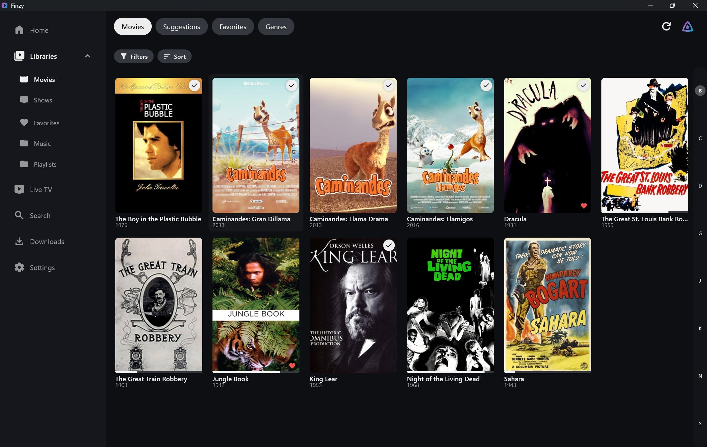 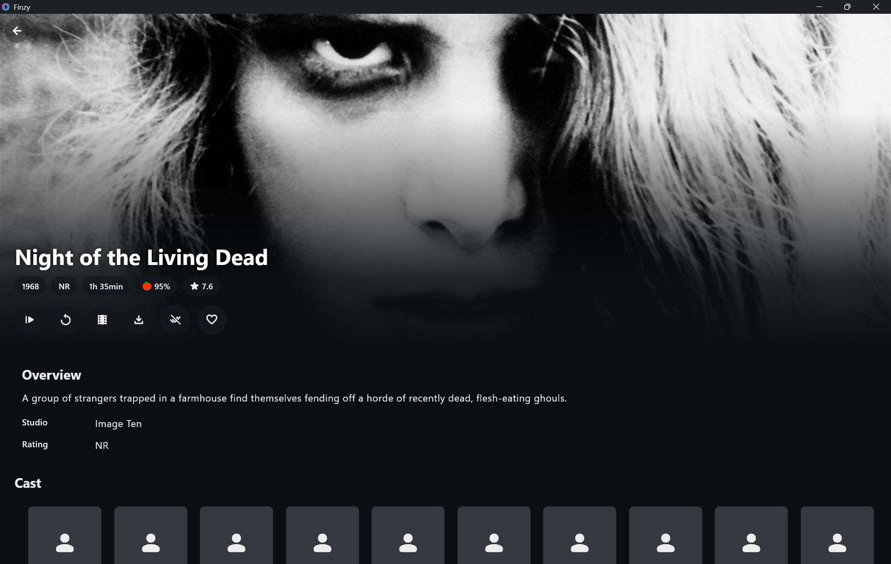 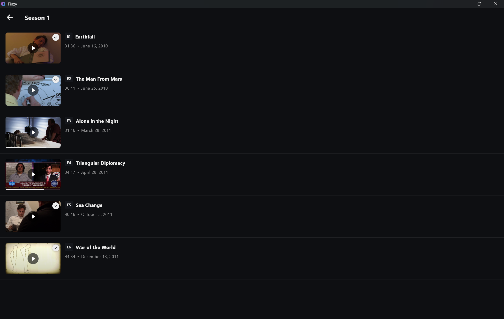

### Tablet

 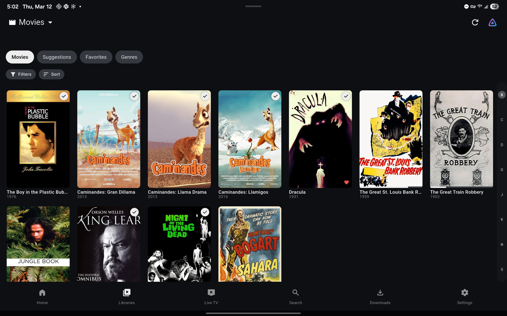 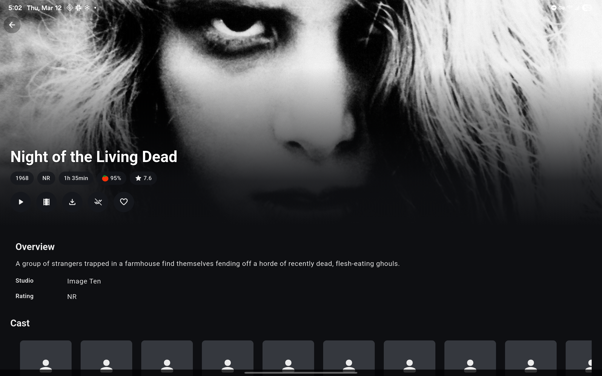 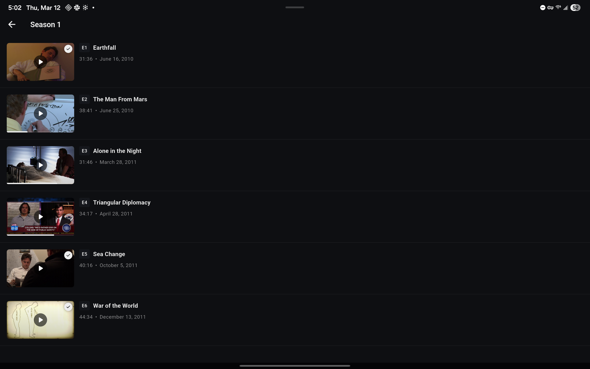

### Phone

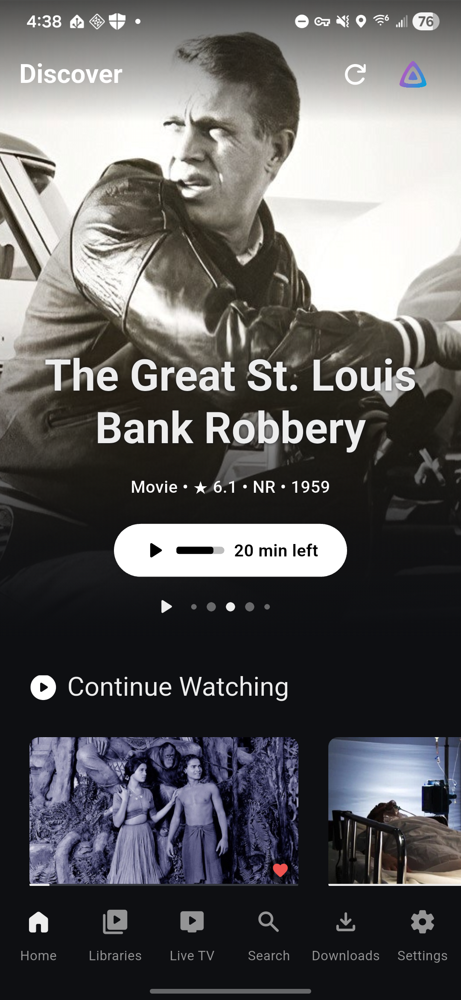 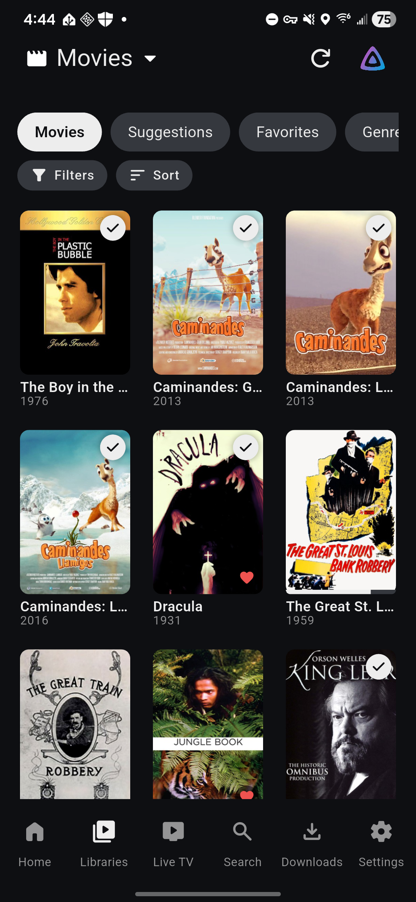 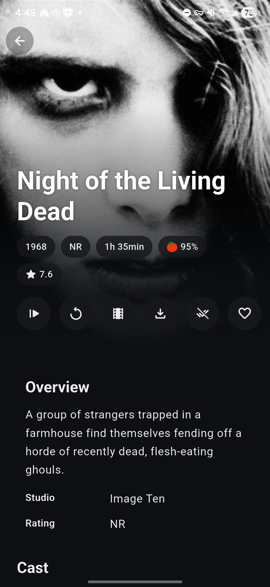 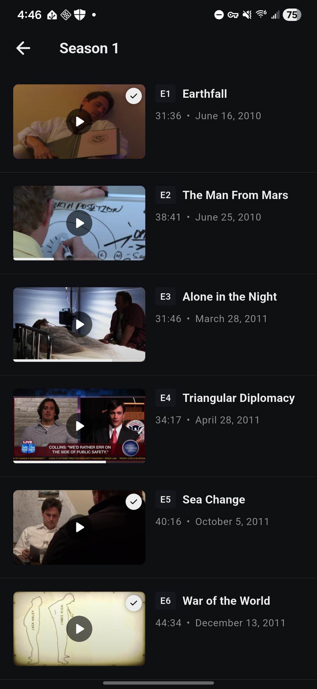

### TV

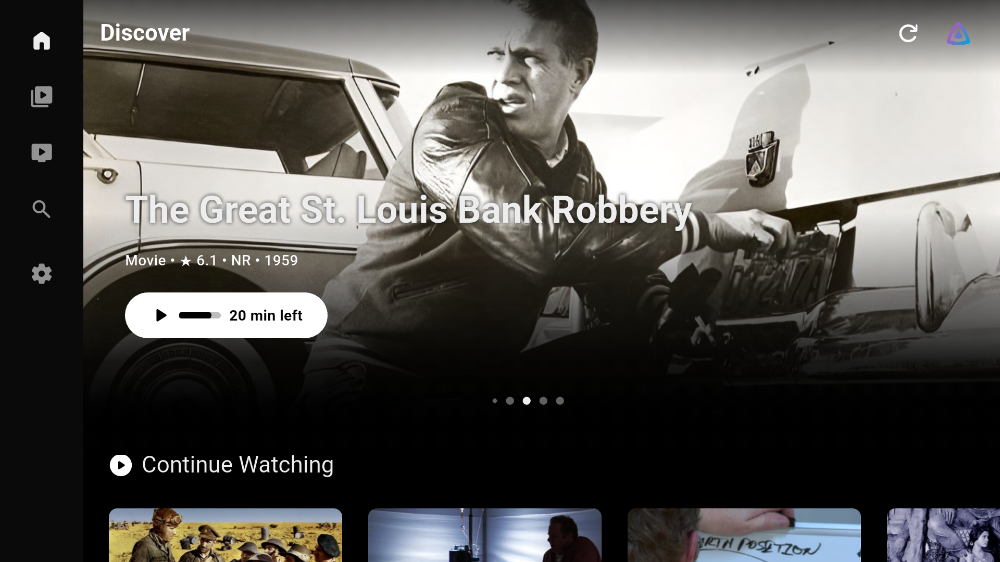 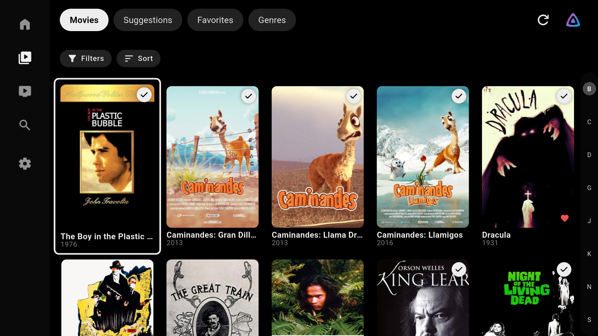 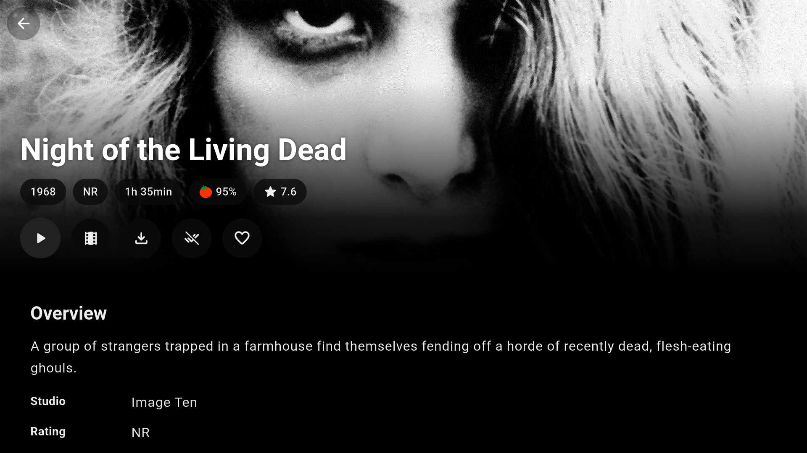 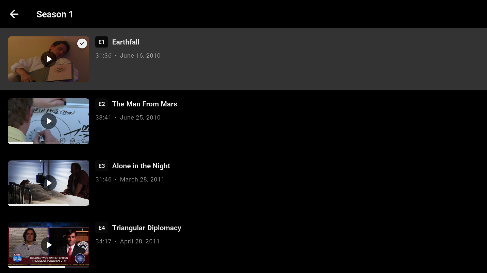
